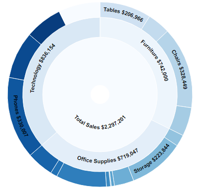

# Sunburst generator

## Generate a sunburst with custom colors based on your worksheet data.

- Customize filtering from the sunburst slice back to your viz.

- Add optional configurable labels

- See the samplestore workbook for a demo

- This is an enhancement to the original Sunburst extension https://github.com/mantsui/Ext_D3_Sunburst.  Kudos to the original creator Man Tsui