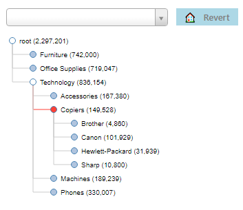

# Node Tree Compact

## Transform your worksheet dimensional data into a vertical hierarchy.

- Use this hierarchy as navigation for your viz.  Optionally show a summarized measure label next to each dimension

- Expand and collapse the hierarchy

- Upon clicking on each level of the hierarchy, filter the worksheet (under the context of the parent)

- Do a global search throughout the hierarchy

- See the samplestore workbook for a demo